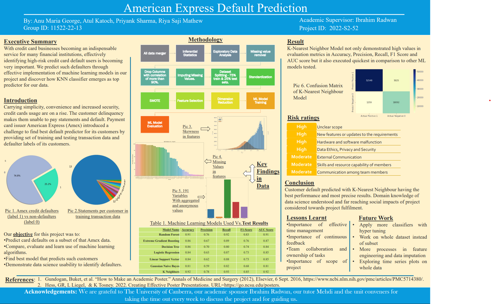

# American-Express-Default-Prediction

## Project Description

This project focuses on the credit default prediction in relation to a worldwide financial services corporation named American Express.It is an internationally diversified payments corporation known to be the biggest payment card issuer in the world.

In this study the performance of various machine learning models will be compared on an industrial scale dataset in order to identify the most effective model. We also calulate the evaluation metric M which is the mean of two measures of rank ordering: Normalized Gini Coefficient, G and default rate captured at 4%, D, Confusion matrix and Area under the curve (AUC).The results of this study have practical significance for guiding financial institutions in reducing losses caused by defaulting credit card customers.

## Data Sources

An industrial scale dataset provided by American Express is used for the development of the 
project. The dataset contains aggregated profile features for each customer at each statement 
date. The dependent variable represents whether a customer has defaulted (1) or repaid (0). The 
features in the dataset are anonymized and normalized and fall into the following general 
category. 

• D_* = Delinquency variables

• S_* = Spend variables 

• P_* = Payment variables 

• B_* = Balance variables 

• R_* = Risk variables 

with the following features being categorical: ['B_30', 'B_38', 'D_114', 'D_116', 'D_117', 
'D_120', 'D_126', 'D_63', 'D_64','D_66', 'D_68']

The train and test datasets have been compressed since the original dataset, which had four.csv files and 50.31 GB of data, was 
difficult for our personal computers to process and analyse.

The test dataset's initial 76924 observations and the training dataset's initial 307696 rows were both extracted and considered for the project.
Link to the original Dataset: https://www.kaggle.com/competitions/amex-default-prediction/data

## Results 

Customer default predicted with K-Nearest Neighbour gave the 
best performance and most precise results. KNN Model not only demonstrated high values in the
evaluation metrics Accuracy, Precision, Recall, F1 Score and 
AUC score but it also executed quickest in comparison to other ML 
models tested.

## Future work

This project can be enhanced using another partition in the data for the validation set. For 
further improvement more classifiers algorithm can be used and try to find the best model 
which is effective and efficient. More Feature extraction/importance and/or feature engineering 
techniques can be used to see if that improve the results. A complete set 
of datasets can be used (you need to have computing power for that scale) to train the model to 
be more effective.

## Acknowledgments

I would like to thank my team members Anu Maria George, Atul Katoch and Priyank Sharma as well as my supervisor Dr.Ibrahim Radwan for their continuous support and inspiration.

